<div
    style="width: auto; text-align: center; margin: 0 auto; padding: 0"
>
    <h1 align="center">OpenGL</h1>
    <h4 align="center">
        <span>
            <a href="https://learnopengl-cn.github.io/"
                >learnopengl-cn</a
            >
            学习示例 --> IDE:Visual Studio Code
        </span>
    </h4>
    <h2 align="left">示例截图</h2>
    <div align="center">
     <div style="margin: 20px">
            <a
                style="margin: 10px"
                href="./src/02_hello_triangle/"
                title="02_hello_triangle"
                >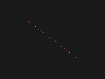</a>
            <a
                style="margin: 10px"
                href="./src/02_hello_triangle/"
                title="02_hello_triangle"
                ></a>
            <a
                style="margin: 10px"
                href="./src/03_hello_triangle_exercise/"
                title="03_hello_triangle_exercise"
                >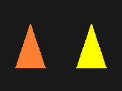</a>
            <a
                style="margin: 10px"
                href="./src/04_shader_glsl/"
                title="04_shader_glsl_01"
                >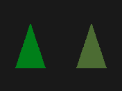</a>
            <a
                style="margin: 10px"
                href="./src/04_shader_glsl/"
                title="04_shader_glsl_02"
                >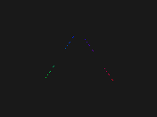</a>
            <a
                style="margin: 10px"
                href="./src/04_shader_glsl/"
                title="05_shader_class"
                >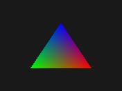</a>
        </div>
        <div style="margin: 20px">
            <a
                style="margin: 10px"
                href="./src/07_load_texture/"
                title="07_load_texture"
                >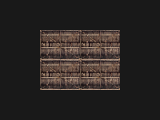</a>
            <a
                style="margin: 10px"
                href="./src/08_load_texture_exercise/"
                title="08_load_texture_exercise"
                >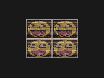</a>
            <a
                style="margin: 10px"
                href="./src/09_transform/"
                title="03_hello_triangle_exercise"
                >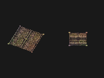</a>
            <a
                style="margin: 10px"
                href="./src/10_use_plane_geometry/"
                title="10_use_plane_geometry"
                >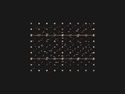</a>
            <a
                style="margin: 10px"
                href="./src/11_use_sphere_geometry/"
                title="11_use_sphere_geometry"
                ></a>
            <a
                style="margin: 10px"
                href="./src/12_use_box_geometry/"
                title="12_use_box_geometry"
                >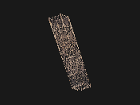</a>
        </div>
         <div style="margin: 20px">
            <a
                style="margin: 10px"
                href="./src/13_model_view_projection/"
                title="13_model_view_projection"
                >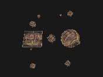</a>
            <a
                style="margin: 10px"
                href="./src/14_use_image_ui/"
                title="14_use_image_ui"
                >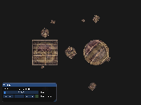</a>
            <a
                style="margin: 10px"
                href="./src/15_mvp_matrix_exercise/"
                title="15_mvp_matrix_exercise"
                >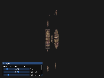</a>
            <a
                style="margin: 10px"
                href="./src/16_use_camera/"
                title="16_use_camera"
                >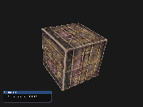</a>
            <a
                style="margin: 10px"
                href="./src/17_use_camera_class/"
                title="17_use_camera_class"
                >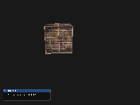</a>
            <a
                style="margin: 10px"
                href="./src/18_light_scene/"
                title="18_light_scene"
                >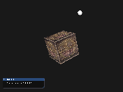</a>
        </div>
             <div style="margin: 20px">
            <a
                style="margin: 10px"
                href="./src/19_basic_lighting/"
                title="19_basic_lighting"
                >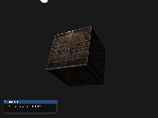</a>
            <a
                style="margin: 10px"
                href="./src/20_light_material/"
                title="20_light_material"
                >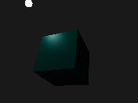</a>
            <a
                style="margin: 10px"
                href="./src/21_light_map/"
                title="21_light_map"
                >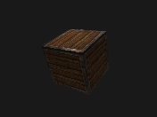</a>
            <a
                style="margin: 10px"
                href="./src/22_light_map_exercise/"
                title="22_light_map_exercise"
                >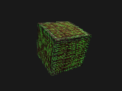</a>
            <a
                style="margin: 10px"
                href="./src/23_direction_light/"
                title="23_direction_light"
                >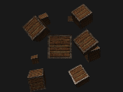</a>
            <a
                style="margin: 10px"
                href="./src/24_point_light/"
                title="24_point_light"
                >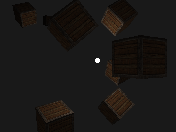</a>
        </div>
        <div style="margin: 20px">
            <a
                style="margin: 10px"
                href="./src/25_spot_light/"
                title="25_spot_light"
                >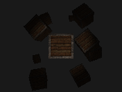</a>
            <a
                style="margin: 10px"
                href="./src/26_multiple_lights/"
                title="26_multiple_lights"
                >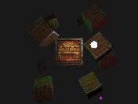</a>
            <a
                style="margin: 10px"
                href="./src/27_load_model/"
                title="27_load_model"
                >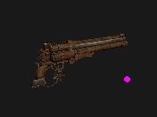</a>
            <a
                style="margin: 10px"
                href="./src/28_depth_testing/"
                title="28_depth_testing"
                >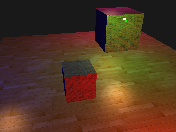</a>
            <a
                style="margin: 10px"
                href="./src/29_stencil_testing/"
                title="29_stencil_testing"
                >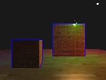</a>
            <a
                style="margin: 10px"
                href="./src/30_blending/"
                title="30_blending"
                >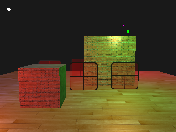</a>
        </div>
        <div style="margin: 20px">
            <a
                style="margin: 10px"
                href="./src/31_face_culling/"
                title="31_face_culling"
                >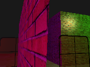</a>
            <a
                style="margin: 10px"
                href="./src/32_frame_buffers/"
                title="32_frame_buffers"
                >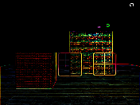</a>
            <a
                style="margin: 10px"
                href="./src/33_cube_maps/"
                title="33_cube_maps"
                >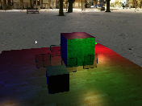</a>
            <a
                style="margin: 10px"
                href="./src/34_env_mapping/"
                title="34_env_mapping"
                >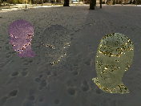</a>
            <a
                style="margin: 10px"
                href="./src/35_advanced_glsl/"
                title="35_advanced_glsl"
                >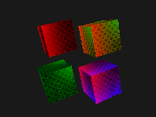</a>
            <a
                style="margin: 10px"
                href="./src/36_geometry_shader/"
                title="36_geometry_shader"
                >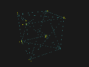</a>
        </div>
        <div style="margin: 20px">
            <a
                style="margin: 10px"
                href="./src/37_instancing/"
                title="37_instancing"
                >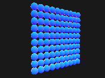</a>
            <a
                style="margin: 10px"
                href="./src/38_anti_aliasing/"
                title="38_anti_aliasing"
                >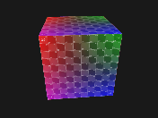</a>
            <a
                style="margin: 10px"
                href="./src/39_blinn_phong/"
                title="39_blinn_phong"
                >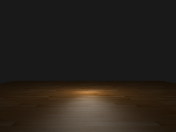</a>
            <a
                style="margin: 10px"
                href="./src/40_gamma_corre/"
                title="40_gamma_corre"
                >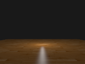</a>
            <a
                style="margin: 10px"
                href="./src/41_shadow_mapping/"
                title="41_shadow_mapping"
                >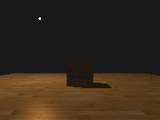</a>
            <a
                style="margin: 10px"
                href="./src/42_point_shadow/"
                title="42_point_shadow"
                >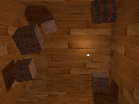</a>
        </div>
        <div style="margin: 20px">
            <a
                style="margin: 10px"
                href="./src/43_normal_mapping/"
                title="43_normal_mapping"
                >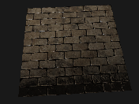</a>
            <a
                style="margin: 10px"
                href="./src/43_normal_tangent/"
                title="43_normal_tangent"
                >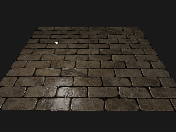</a>
            <a
                style="margin: 10px"
                href="./src/44_parallax_mapping/"
                title="44_parallax_mapping"
                >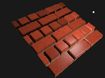</a>
            <a
                style="margin: 10px"
                href="./src/45_heigh_dynamic_range/"
                title="45_heigh_dynamic_range"
                >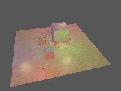</a>
            <a
                style="margin: 10px"
                href="./src/46_bloom/"
                title="46_bloom"
                >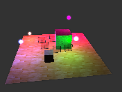</a>
            <a
                style="margin: 10px"
                href="./src/47_deferred_shading/"
                title="47_deferred_shading"
                >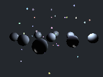</a>
        </div>
        <div style="margin: 20px">
            <a
                style="margin: 10px"
                href="./src/48_ssao_shading/"
                title="48_ssao_shading"
                >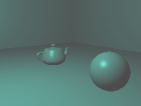</a>
            <a
                style="margin: 10px"
                href="./src/49_pbr_light/"
                title="49_pbr_light"
                >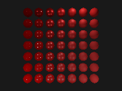</a>
            <a
                style="margin: 10px"
                href="./src/49_pbr_light/"
                title="49_pbr_light"
                >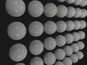</a>
            <a
                style="margin: 10px"
                href="./src/50_diffuse_ibl/"
                title="50_diffuse_ibl"
                >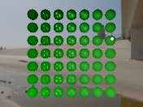</a>
            <a
                style="margin: 10px"
                href="./src/51_specular_ibl/"
                title="51_specular_ibl"
                ></a>
            <a
                style="margin: 10px"
                href="./src/51_specular_ibl/"
                title="51_specular_ibl"
                ></a>
        </div>
    </div>
</div>

<div>
    <h1 align="center"> Windows 下 VSCode 配置 OpenGL 开发环境
    </h1>
</div>

## 参考

- windows 需安装 [`tdm64-gcc`](https://github.com/jmeubank/tdm-gcc/releases/download/v10.3.0-tdm64-2/tdm64-gcc-10.3.0-2.exe) (gcc & g++ -v == 10.3.0)，进入到 `C:\TDM-GCC-64\bin` 文件夹下备份 `mingw32-make.exe` 并修改成 `make.exe`，作为 `Makefile`指定编译器
- vscode 插件 [`C/C++`](https://marketplace.visualstudio.com/items?itemName=ms-vscode.cpptools)、[`C/C++ Project Generator`](https://marketplace.visualstudio.com/items?itemName=danielpinto8zz6.c-cpp-project-generator)
- glfw库

  > 对于 Windows，下载 [`Windows pre-compiled binaries`](https://www.glfw.org/download.html)，因为我们使用的 TDM-GCC-64 所以选择 [`64-bit Windows binaries`](https://github.com/glfw/glfw/releases/download/3.3.9/glfw-3.3.9.bin.WIN64.zip)，注意需要将.dll文件移动至output文件夹，.a文件移动至lib文件夹，include中文件复制至项目下的include文件夹
  >
  > 对于 Ubuntu，通过 `sudo apt install libglfw3-dev libglfw3` 安装 glfw
  >
  
- glad

  > [`在线服务`](https://glad.dav1d.de/) 生成静态库
  >

  ```
  > gcc ./src/glad.c -c -I ./include/ // 生成 .o文件
  > ar -rc libglad.a glad.o           // 生成我们所需要的 .a文件
  ```

  > 将生成的 libglad.a 复制到 lib 文件下，include中文件复制至项目下的include文件夹
  >
- glm库

  > 下载头文件复制到 include 目录下
  >
- imgui

  > 复制到 include 目下,Makefile 中添加以下命令
  >

  ```mk
  # define the C source files
  SOURCES		:= $(wildcard $(patsubst %,%/*.cpp, $(SOURCEDIRS)))
  SOURCES	+= include/imgui/imgui_impl_glfw.cpp include/imgui/imgui_impl_opengl3.cpp
  SOURCES	+= include/imgui/imgui.cpp include/imgui/imgui_demo.cpp include/imgui/imgui_draw.cpp include/imgui/imgui_widgets.cpp
  ```
- assimp 库

  > 对于 Windows，需参考[相关编译流程](https://zhuanlan.zhihu.com/p/467620741)自行编译，仓库中所存为[`Assimp-v5.3.1.zip`](https://github.com/assimp/assimp/archive/refs/tags/v5.3.1.zip)于Windows环境下经过[`Cmake-GUI-v3.26.3`](https://cmake.org/files/v3.26/cmake-3.26.3-windows-x86_64.msi)编译得到
  >
  > 对于 Ubuntu，通过 `sudo apt install libassimp-dev` 安装 assimp
  >

- [参考 Makefile 文件](https://github.com/yocover/start-learning-opengl/blob/main/Makefile)
- [参考配置视频](https://www.bilibili.com/video/BV1BX4y1g7R6/?spm_id_from=333.337.search-card.all.click&vd_source=ba34446636c9dae4b98f1dfd7df3f121)

## 示例

### 1. Run 和 Clean

**测试代码**

```c++
#include <glad/glad.h>
#include <GLFW/glfw3.h>

#include <iostream>

void framebuffer_size_callback(GLFWwindow *window, int width, int height);
void processInput(GLFWwindow *window);

const unsigned int SCR_WIDTH = 800;
const unsigned int SCR_HEIGHT = 600;

int main()
{
	glfwInit();
	glfwWindowHint(GLFW_CONTEXT_VERSION_MAJOR, 3);
	glfwWindowHint(GLFW_CONTEXT_VERSION_MINOR, 3);
	glfwWindowHint(GLFW_OPENGL_PROFILE, GLFW_OPENGL_CORE_PROFILE);

	GLFWwindow *window = glfwCreateWindow(SCR_WIDTH, SCR_HEIGHT, "LearnOpenGL", NULL, NULL);
	if (window == NULL)
	{
		std::cout << "Failed to create GLFW window" << std::endl;
		glfwTerminate();
		return -1;
	}
	glfwMakeContextCurrent(window);
	glfwSetFramebufferSizeCallback(window, framebuffer_size_callback);

	if (!gladLoadGLLoader((GLADloadproc)glfwGetProcAddress))
	{
		std::cout << "Failed to initialize GLAD" << std::endl;
		return -1;
	}

	while (!glfwWindowShouldClose(window))
	{
		processInput(window);
		glfwSwapBuffers(window);
		glfwPollEvents();
	}

	glfwTerminate();
	return 0;
}

void processInput(GLFWwindow *window)
{
	if (glfwGetKey(window, GLFW_KEY_ESCAPE) == GLFW_PRESS)
		glfwSetWindowShouldClose(window, true);
}

void framebuffer_size_callback(GLFWwindow *window, int width, int height)
{
	glViewport(0, 0, width, height);
}
```

**执行命令 run 编译和运行.exe 程序**

```Bash
make run dir=01_test_glfw
```

**执行命令 clean 删除 .exe 和对应文件夹下的.o 文件**

```Bash
make clean dir=01_test_glfw
```

### 2. Debug

需要设置调试一个文件 修改 `tasks.json`下面的条目

```js
 "label": "build",
  "type": "shell",
  "group": {
      "kind": "build",
      "isDefault": true
  },
  "windows": {
      "command": "powershell",
      "args": [
          "-c",
          "make dir=01_test_glfw", // 调式 01_test_glfw/main.cpp
      ]
  },
```
